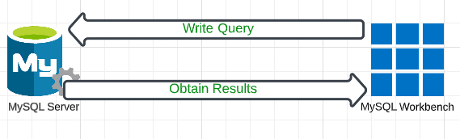

### First steps in MySQL  
#### Install MySQL
Our Server  
#### Install MySQL workbench
A Client of a MySQL Server for database design, modelling, creation, manipulation, maintenance, administration. More of an IDE
### The Client-Server Model  
  
### Creating a Database  

```
CREATE DATABASE [IF NOT EXISTS] database_name;
```  
```[IF NOT EXISTS]```  
Verifies if a database with the same name exists already - It's optional though  

*The SQL code is not case sensitive*  

### Creating Table
```
CREATE DATABASE [IF NOT EXISTS] sales;
CREATE TABLE table_name ( );
```
*You should add atleast one column when creating a table*  
```
create table sales
(
	purchase_number int auto_increment,
    date_of_purchase date,
    customer_id int,
    item_code varchar(10),
primary key (purchase_number)
);
```

### String Data Types  
Example  

character `CHAR(5)`  
variable character `VARCHAR(5)`  
ENUM (“enumerate”) `ENUM(‘M’,’F’)`

*for Enum, MySQL will show an error if you attempt to insert any value different from “M” or “F”*  

### Creating a table exercise  
Create the “customers” table in the “sales” database. Let it contain the following 5 columns: customer_id, first_name, last_name, email_address, and number_of_complaints. Let the data types of customer_id and number_of_complaints be integer, while the data types of all other columns be VARCHAR of 255