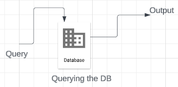

SQL - Structured Query Language
> Programming language specifically designed for working with databases. To create and manipulate relational databases

Allows you to write queries that the computer can execute and then provide database insight  

  
#### Why MySQL  
- DBMS to implement SQL Commands
- Reliable, mature, opensource

#### Main components of SQL Syntax
1. Data Definition Language (DDL)  
> Cretion of data
> - Create
> - Alter
> - Drop
> - Truncate
> - Rename

2. Data Manipulation Language (DML)
> Manipulation of data
> - Select
> - Insert
> - Delete

3. Data Control Language (DCL)
> Assignment and removal of permissions
> - Grant
> - Revoke

4. Transaction Control Language (TCL)
> Saving and restoring changes to a database
> - Commit
> - Rollback